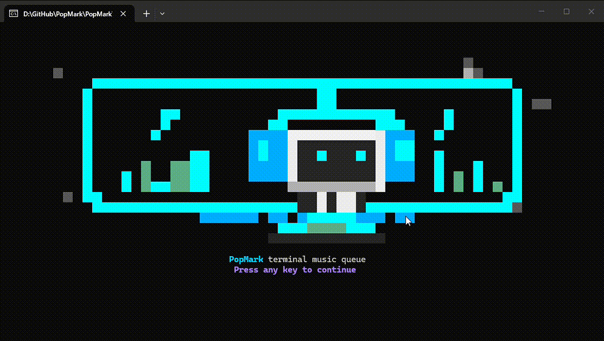

# PopMark

A small terminal music queue for YouTube videos and playlists.

PopMark expands links with `yt-dlp`, streams audio through `mpv`, and keeps your queue available between launches.


## Features

- Add YouTube videos or playlists from the terminal
- Stream through `mpv` without downloading music files
- Restore the previous queue on launch
- Toggle full and mini player views
- Arrow-key seeking, skip, previous track, pause, resume, and clear the playlist
- Install local playback tools without admin access

## Demo



## Requirements

- .NET 9 SDK
- `yt-dlp`
- `mpv`

PopMark can install `yt-dlp` and portable `mpv` locally:

```powershell
dotnet run --project .\PopMark\PopMark.csproj -- deps
```

Local tools are stored in `%LOCALAPPDATA%\PopMark\tools`.
Queue state is stored in `%LOCALAPPDATA%\PopMark\queue.json`.

## Run

```powershell
dotnet run --project .\PopMark\PopMark.csproj
```

Start with a URL:

```powershell
dotnet run --project .\PopMark\PopMark.csproj -- "https://www.youtube.com/watch?v=..."
```

Run a short non-interactive playback test:

```powershell
dotnet run --project .\PopMark\PopMark.csproj -- play-test "https://www.youtube.com/watch?v=..." --seconds 15
```

## Commands

| Command | Action |
| --- | --- |
| `add <url>` | Add a YouTube video or playlist |
| `play` / `pause` | Toggle playback |
| `next [count]` / `]` | Skip to the next track, or skip multiple tracks with a count |
| `prev [count]` / `previous [count]` / `[` | Return to the previous track, or go back multiple tracks with a count |
| `Left Arrow` / `Right Arrow` | Seek backward or forward by 10 seconds |
| Click progress bar | Jump to that timestamp when the terminal supports mouse input |
| `Up Arrow` / `Down Arrow` / mouse wheel | Scroll the playlist panel by one row |
| `PageUp` / `PageDown` / `Home` / `End` | Scroll the playlist panel faster |
| `clear playlist` | Stop playback and empty the queue |
| `mini` | Toggle compact player mode |
| `cls` / `clear` | Redraw the terminal UI |
| `quit` | Stop playback and exit |
