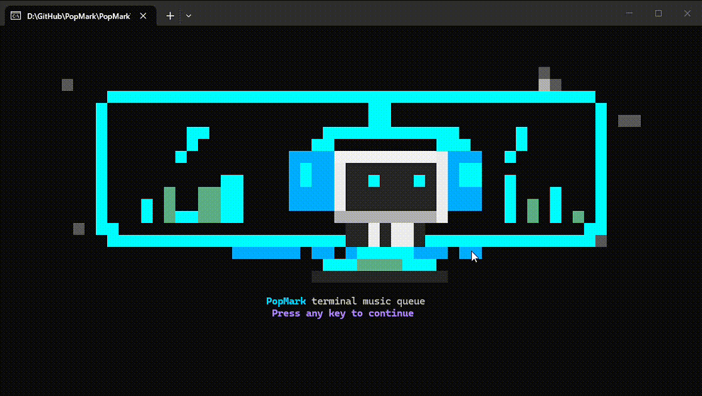

# PopMark

A small terminal music queue for YouTube videos and playlists.

PopMark expands links with `yt-dlp`, streams audio through `mpv`, and keeps your queue available between launches.


## Features

- Add YouTube videos or playlists from the terminal
- Stream through `mpv` without downloading music files
- Restore the previous queue on launch
- Arrow-key seeking, clickable playlist navigation, pause, resume, and clear the playlist
- Install local playback tools without admin access

## Demo



## Requirements

- .NET 9 SDK
- `yt-dlp`
- `mpv`

PopMark asks to install missing playback tools locally on first interactive run.

Local tools are stored in `%LOCALAPPDATA%\PopMark\tools`.
Queue state is stored in `%LOCALAPPDATA%\PopMark\queue.json`.
Pinned tool paths are stored in `%LOCALAPPDATA%\PopMark\tools.json`.

### Finding yt-dlp and mpv

PopMark looks for each tool in this order:

1. A path pinned with `tools set` (saved in `tools.json`)
2. The `POPMARK_YTDLP_PATH` / `POPMARK_MPV_PATH` environment variables
3. PopMark's own copy under `%LOCALAPPDATA%\PopMark\tools`
4. `PATH`, plus the usual WinGet, Scoop, and Chocolatey shim folders
5. A scan of the WinGet, Scoop, Chocolatey, and Program Files package folders

That last step covers installs that never landed on `PATH`, such as a WinGet package folder
like `%LOCALAPPDATA%\Microsoft\WinGet\Packages\yt-dlp.yt-dlp_Microsoft.Winget.Source_8wekyb3d8bbwe\yt-dlp.exe`.

Because mpv shells out to yt-dlp itself, PopMark passes the resolved yt-dlp to mpv explicitly
and adds its folder to the PATH the child process inherits. Without that, mpv reports
`youtube-dl failed: not found or not enough permissions` even when PopMark loaded the playlist fine.

Run `tools` at any time to see what PopMark resolved:

```
tools                                       show resolved paths and whether each tool runs
tools install [yt-dlp|mpv|all]              install a private copy under %LOCALAPPDATA%\PopMark\tools
tools set yt-dlp "C:\path\to\yt-dlp.exe"    pin a copy you already have
tools clear yt-dlp                          forget a pinned path
```

`popmark tools` also works from the shell without entering the UI.

If a track will not play, run the non-interactive test and send the output:

```powershell
PopMark.exe play-test "https://www.youtube.com/watch?v=..." --seconds 10
```

It exits with code 3 and prints whatever mpv reported, such as an HTTP 403 from an
out-of-date yt-dlp.

## Run

```powershell
dotnet run --project .\PopMark\PopMark.csproj
```

Start with a URL:

```powershell
dotnet run --project .\PopMark\PopMark.csproj -- "https://www.youtube.com/watch?v=..."
```

Run a short non-interactive playback test:

```powershell
dotnet run --project .\PopMark\PopMark.csproj -- play-test "https://www.youtube.com/watch?v=..." --seconds 15
```

Check the app version:

```powershell
dotnet run --project .\PopMark\PopMark.csproj -- --version
```

## Versioning

Published builds use semantic versioning from `PopMark/PopMark.csproj`.
Update `Version`, `AssemblyVersion`, `FileVersion`, and `InformationalVersion` together before publishing a release.

## Stack

  - Language: C#
  - Runtime / Framework: .NET 9
  - Project type: Console app / terminal UI
  - Terminal UI library: Spectre.Console
  - Archive extraction dependency: SharpCompress
  - Playback engine: mpv
  - YouTube metadata / playlist expansion: yt-dlp


## Commands

| Command | Action |
| --- | --- |
| `add <url or search>` | Add a YouTube video, playlist, or search result |
| `play` / `pause` | Toggle playback |
| `goto <#\|title>` | Scroll to a playlist song |
| `shuffle` | Randomize the playlist |
| `tools` | Show resolved playback tool paths, install or pin them |
| `version` | Show the current app version |
| `clear playlist` | Stop playback and empty the queue |
| `clear` / `cls` | Redraw the screen |
| `help` | Show typed commands |
| `controls` | Show keyboard and mouse controls |
| `quit` | Stop playback and exit |

## Controls

| Control | Action |
| --- | --- |
| `Space` | Toggle playback when the command field is empty |
| `-` / `=` | Decrease or increase volume by 10% |
| `Left Arrow` / `Right Arrow` | Seek backward or forward by 10 seconds |
| `Up Arrow` / `Down Arrow` / mouse wheel | Scroll the playlist panel by one row |
| `PageUp` / `PageDown` | Scroll the playlist panel faster |
| `Home` / `End` | Jump to the top or bottom of the playlist |
| Click playlist song | Play that song directly |
| Click progress bar | Jump to that timestamp when the terminal supports mouse input |
